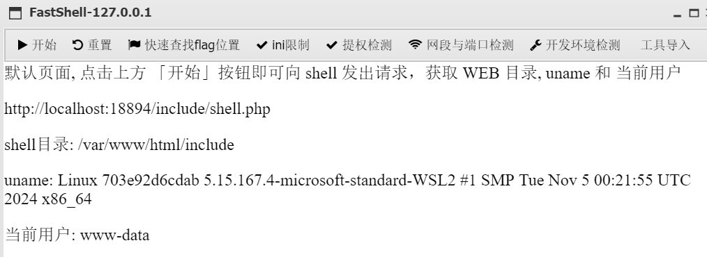
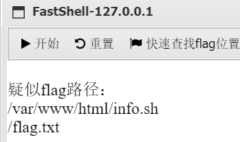
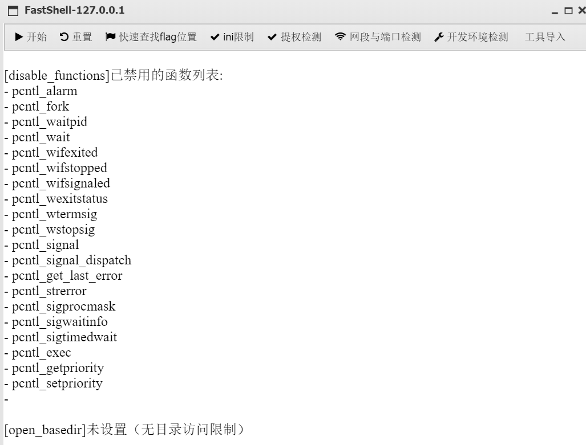
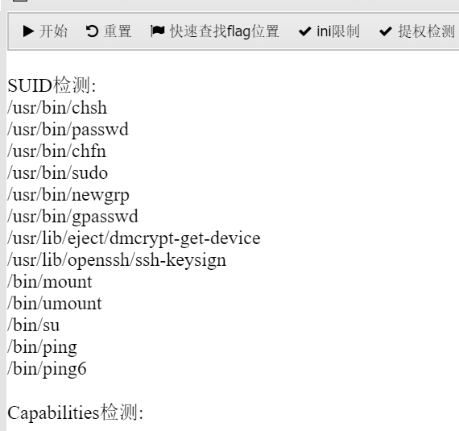
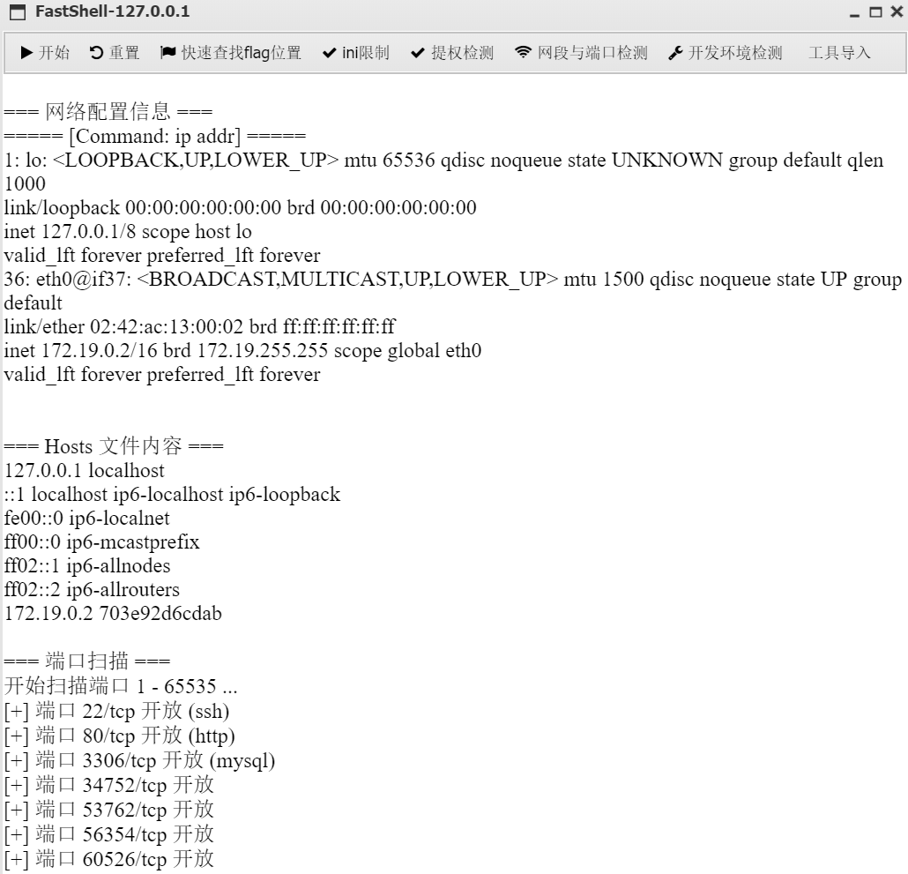
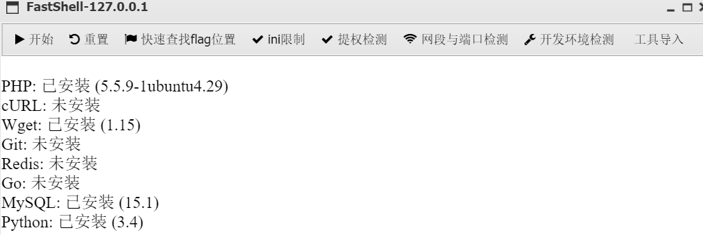

# FastShell

一个普通的自用集成插件，因为没啥技术力就不专门发布在 AntSword-Store 了

仅支持 php

功能:

- 获取用户，shell 目录等基本信息

- 模糊查找 flag 位置

- ini限制：返回 disable_function 和 open_basedir

  

- 提权检测：目前只有 SUID 检测和 Capabilities 检测

  

- 网段与端口检测

  

- 开发环境检测

  

- 安全工具导入（待施工...）