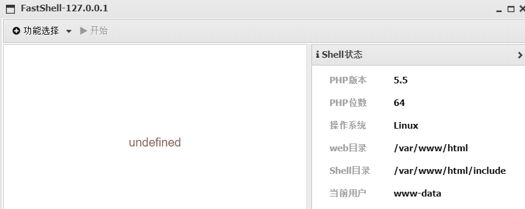
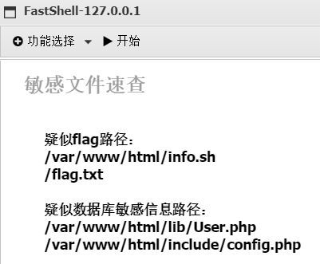
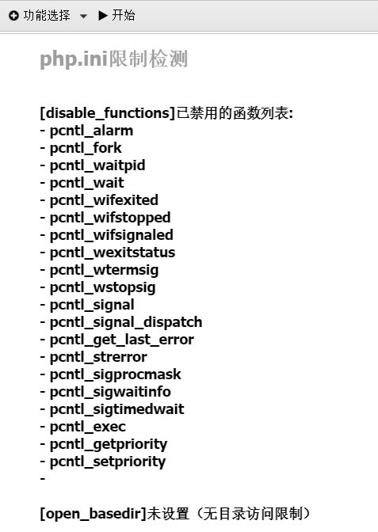
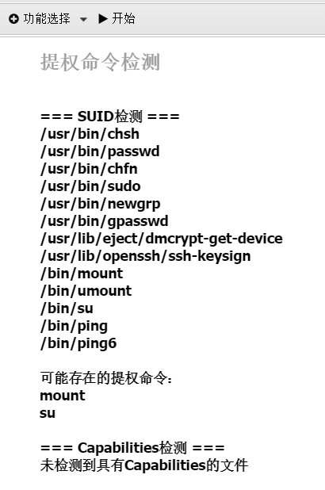
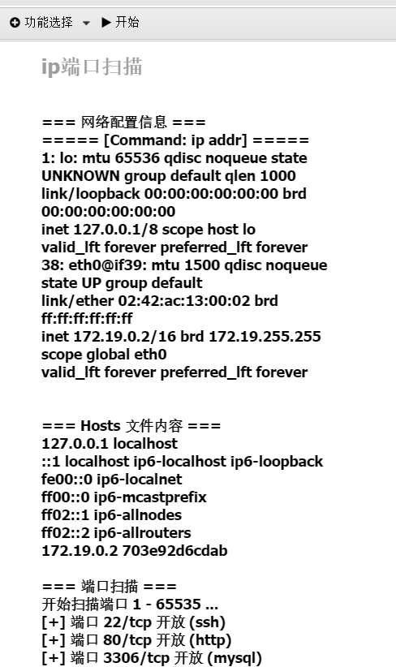
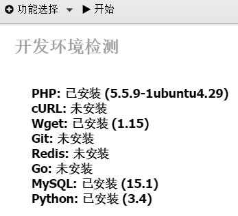
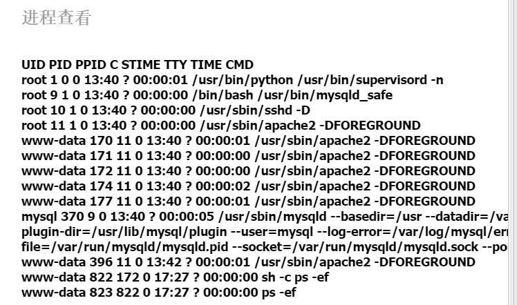

# FastShell

一个普通的自用集成插件，因为没啥技术力就不专门发布在 AntSword-Store 了

前端仿照 bypass_php_disable 插件框架

目前仅支持 php

功能：

- Shell状态：获取用户，shell 目录等基本信息

  

- 敏感文件速查：通过正则匹配模糊查找，目前支持 flag 和 数据库敏感信息

  

- php.ini限制：目前支持 disable_function 和 open_basedir

  

- 提权检测：目前支持 SUID 检测和 Capabilities 检测

  

- 网段与端口检测：支持 Windows 和 Linux ，读取 hosts 文件，扫描端口

  

- 开发环境检测

  

- 进程查看

  

未来可能实现的功能：

- 支持更多文件的搜索

- 安全工具导入

- 反弹shell

- 代理搭建